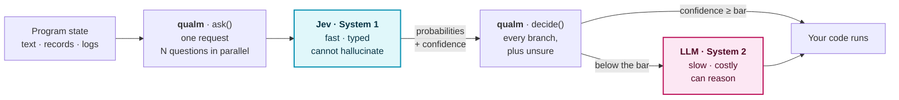
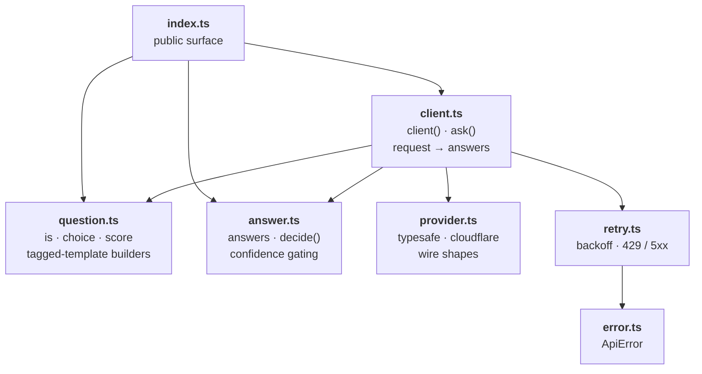

<p align="center">
  
</p>

<p align="center">
  <a href="https://github.com/qddegtya/qualm/actions/workflows/ci.yml"></a>
  <a href="./LICENSE"></a>
  
  
  
</p>

Typed decisions from a System One model ([TypeSafe's Jev](https://typesafe.ai/)), where uncertainty
is something you have to handle.

A judgment that collapses to `boolean`, or to a bare `argmax`, throws away the one signal that tells
you when to escalate. `qualm` never does that: every decision has an `unsure` branch, and the
compiler will not let you forget it.

---

## Why this shape

The terms come from the dual-process literature. **System 1** is fast, automatic, low-effort
judgment; **System 2** is slow, deliberate, effortful reasoning. Stanovich and West named them in
[_Individual differences in reasoning_](https://www.cambridge.org/core/journals/behavioral-and-brain-sciences/article/abs/individual-differences-in-reasoning-implications-for-the-rationality-debate/2906AEF620B36C10018DD291F790BE97)
(Behavioral and Brain Sciences 23(5), 2000, 645–665), and Kahneman made them common currency in
_Thinking, Fast and Slow_ (2011), where he credits them for the vocabulary.

Software has had only System 2. An LLM is slow, expensive, and can genuinely reason — so it became
the interpreter of the program, with your code demoted to the tools it calls. That was never a
design; it was a workaround for the fact that a semantic `if` cost seconds and could hallucinate.

A System One model changes the arithmetic. Jev answers typed questions in roughly a tenth of a
second, returns probabilities instead of prose, and cannot invent an option you did not give it.
With a cheap typed judgment available, control goes back to your code — and the only thing left to
design is the seam where fast judgment hands over to slow reasoning.

**`unsure` is that seam, and this library is built around making it impossible to skip.**



## Install

```sh
pnpm add qualm
```

Zero runtime dependencies. ESM only, Node 20+. Runs in Node, Workers, Deno, Bun and the browser.

## Ask

Questions in one request are evaluated independently and in parallel, and latency barely grows with
their number — so ask many narrow questions rather than one broad one. The API takes a record
because a record is honest about that: asking ten things costs about what asking one costs.

```ts
import { choice, client, is, score } from "qualm";

const jev = client({ provider: "cloudflare", accountId: "…" }); // reads CLOUDFLARE_API_TOKEN

const { team, urgent, severity } = await jev.ask(ticket, {
  team: choice`Which team should handle this?`({
    billing: "Payments, invoicing, refunds",
    technical: "Bugs, outages, integrations",
    sales: null,
  }),
  urgent: is`This message conveys urgency`,
  severity: score`How severe is this for the customer?`([
    "Cosmetic",
    "A workaround exists",
    "Blocks production",
  ]),
});
```

| Ask                 | With                 | Read                                    |
| ------------------- | -------------------- | --------------------------------------- |
| Which one of these? | ``choice`…`({ … })`` | `.top`, `.confidence`, `.probabilities` |
| Is this true?       | ``is`…` ``           | `.probability`, `.confidence`, `.top`   |
| How much?           | ``score`…`([ … ])``  | `.value`, `.confidence`, `.legend`      |

## Decide

`decide` is a `switch` that the compiler makes total. Every label needs a branch, `unsure` needs a
branch, and nothing else is allowed:

```ts
const action = team.decide({
  billing: () => refund(ticket),
  technical: () => file(ticket),
  sales: () => assign(ticket),
  unsure: () => escalate(ticket), // required — leave it out and this will not compile
});
```

Add a label to the question later and every `decide` call breaks until you handle it. A plain
`switch` with a `default` would have swallowed it.

`unsure` runs whenever confidence falls below the bar, which makes it the natural place to hand over
to System 2:

```ts
unsure: () => opus(`Read this ticket and route it: ${ticket}`),
```

Branches do whatever you need: side effects, values, or both. `decide` returns exactly what the
branch that ran returned — it never wraps it.

```ts
// Every branch synchronous: a plain value comes back, with no `await` and no microtask.
team.decide({ billing: () => refund(t), sales: () => assign(t), unsure: () => queue(t) });

// One branch async: that branch's promise comes back, so `await` the call.
const outcome = await team.decide({ …, unsure: () => opus(`Route this: ${t}`) });
```

**`decide` is never `async` itself**, so a decision that does no I/O costs no tick and still works
inside a synchronous context:

```ts
const urgent = tickets.filter((t) =>
  t.flag.decide({ yes: () => true, no: () => false, unsure: () => false }),
);
```

Mixing a synchronous branch with an `async` one gives a union — `void | Promise<string>` above — and
`await` flattens it. Forgetting that `await` would make the escalation fire-and-forget, so keep a
type-aware linter on; `no-floating-promises` sees the promise inside that union and reports it:

```sh
oxlint --type-aware -D typescript/no-floating-promises .   # or @typescript-eslint/no-floating-promises
```

A yes/no answer splits the same way, into `yes`, `no` and `unsure`.

### The bar

```ts
client({ …, confidence: 0.8 });           // for everything this client asks
team.decide({ … }, { confidence: 0.95 }); // higher, because this branch deletes things
```

Confidence exactly on the bar counts as sure. The default is `0.7`, and **it is arbitrary** — there
is no principled value. Measure your own data and set your own.

### `top` is the escape hatch

`.top` is the highest-probability label. It is there for logs and metrics, and it is named `top`
rather than `value` because it is only the one that came first — `{ bug: 0.34, other: 0.33 }` has a
top too. Reading it skips the uncertainty check, on purpose and visibly, the way `unwrap` does.

## Providers

```ts
client({ provider: "cloudflare", accountId, apiKey }); // CLOUDFLARE_ACCOUNT_ID, CLOUDFLARE_API_TOKEN
client({ provider: "typesafe", apiKey }); //             TYPESAFE_API_KEY
```

Keys fall back to those environment variables, read at call time — importing this package runs
nothing, which is what `sideEffects: false` promises.

## Failures

A refused request throws `ApiError` with its `status` and parsed `body`. Rate limits (`429`) and
server faults (`5xx`) are retried with exponential backoff, honouring `Retry-After`; anything you got
wrong is not retried, because trying again cannot help.

```ts
client({ …, retry: { attempts: 3, baseDelay: 500 } });
await jev.ask(ticket, questions, { signal });
```

## Inside

Seven small modules, no cycles, nothing exported that is not part of the public surface.



## Types are the point

This library exists because a type can make you handle something. The strictness is not decoration:

| Guarantee                               | How                                                                         |
| --------------------------------------- | --------------------------------------------------------------------------- |
| Every branch handled, `unsure` included | A mapped handler type over `keyof criteria \| "unsure"`, all required       |
| A stale branch cannot linger            | `Record<Exclude<keyof H, …>, never>` rejects a key that is not a branch     |
| Labels are your literals, not `string`  | `infer O extends Options` carries the question's options into its answer    |
| A rubric keeps its levels               | A `const` type parameter keeps `score` levels a tuple instead of `string[]` |
| Sync branches beside an async one       | `ReturnType<H[keyof H]>` returns their union instead of forcing agreement   |
| A forgotten `await` is caught           | The union keeps a `Promise` in it, which `no-floating-promises` keys on     |
| Invalid client config cannot be written | A discriminated union: `cloudflare` needs `accountId`, `typesafe` does not  |

`tsconfig` runs `strict` plus `exactOptionalPropertyTypes`, `noUncheckedIndexedAccess`,
`noPropertyAccessFromIndexSignature`, `noImplicitReturns`, `noFallthroughCasesInSwitch`,
`noUnusedLocals`, `noUnusedParameters` and `erasableSyntaxOnly`. There is no `any` and no `!` in
`src`; the few `as` casts sit at wire boundaries and each carries a comment stating its guarantee.

Tests are written failing first, and type-level behaviour is tested too: a `@ts-expect-error` that
stops erroring breaks the build, so "this must not compile" is a real, verifiable test.

```sh
pnpm run check    # oxlint → type-aware lint → tsc --noEmit → vitest with coverage
pnpm run verify   # check → build → are-the-types-wrong
```

`publint` and `@arethetypeswrong/cli` gate what gets published, so the package's `exports` and its
declarations are verified to resolve before a release, not after.

## What this does not claim

Jev's probabilities are what the model reported. They are **not** independently established as
calibrated: one reproducible third-party benchmark measured worse accuracy _and_ worse calibration
than a small frontier model on its task. Making you handle uncertainty is the whole point precisely
because the number cannot be trusted blindly. The evidence, and every API fact this library relies
on, is recorded with its source and the date it was checked in [`docs/jev-api.md`](./docs/jev-api.md).

## License

[MIT](./LICENSE)
