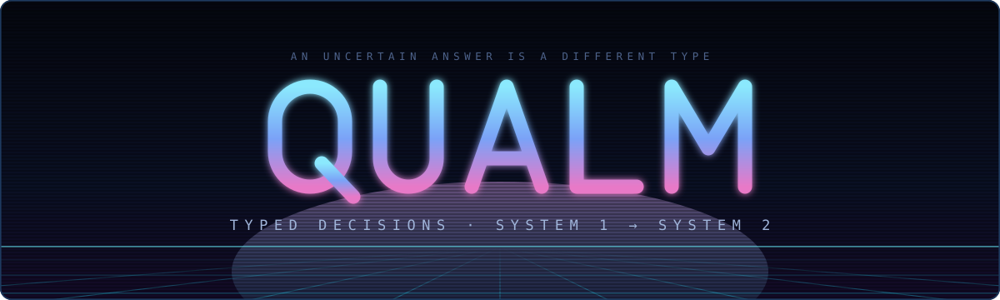
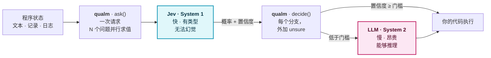
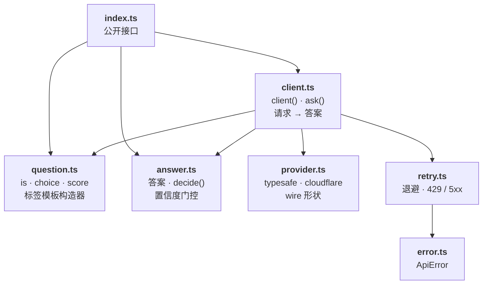

<p align="center">
  
</p>

<p align="center">
  <a href="https://www.npmjs.com/package/@atools/qualm"></a>
  <a href="https://github.com/qddegtya/qualm/actions/workflows/ci.yml"></a>
  
  
  
  <a href="./LICENSE"></a>
</p>

<p align="center"><a href="./README.md">English</a> · <b>简体中文</b></p>

面向 System One 模型（[TypeSafe 的 Jev](https://typesafe.ai/)）的类型化决策库 —— 在这里，**不确定性是一件你必须处理的事**。

一个把判断塌缩成 `boolean`、或者塌缩成一个裸 argmax 的 API，扔掉的恰恰是唯一能告诉你"该升级了"的信号。qualm 不这么干：每一次决策都有 `unsure` 分支，而且编译器不允许你忘记它。

## 这个库带来了什么

Jev 是模型。下面这些是 `qualm` 在"自己去调它的 HTTP API"之上加的东西。

- **问题读起来就是问题。** 标签模板让问题文本**本身就是代码** —— ``is`这条消息透露出紧急感` `` —— 而不是一个由 `type`、`instructions`、`criteria` 拼出来的 JSON 字面量。
- **答案的类型就是你的类型。** 选项以你声明的字面量联合返回，而不是 `string`，所以分支名拼错是编译错误，而不是静默失配。
- **不确定性是一个你必须写出来的分支。** `unsure` 是每次决策的必填键，忽略它的决策编译不过。
- **交接给 System 2 只需要一行。** 把 LLM 调用放进 `unsure`，`decide` 会把它的 promise 原样透传 —— 这次交接没有任何特殊处理。
- **Jev 的三个原语全部支持**，且各自保留完整的概率分布和置信度：`is` 判断命题，`choice` 做选择，`score` 对评分表定位。
- **一套 API 背后两个 provider** —— TypeSafe 官方端点与 Cloudflare Workers AI。
- **重试、取消与类型化错误。** `429` 和 `5xx` 上的退避重试（遵守 `Retry-After`）、`AbortSignal` 支持，以及携带状态码和已解析 body 的 `ApiError`。
- **零运行时依赖**，以 ESM 和 CJS 双格式发布，各自带独立的类型声明。

---

## 为什么是这个形状

这两个术语来自双过程理论。**System 1** 是快速、自动、低耗的判断；**System 2** 是缓慢、审慎、费力的推理。Stanovich 与 West 在 [_Individual differences in reasoning_](https://www.cambridge.org/core/journals/behavioral-and-brain-sciences/article/abs/individual-differences-in-reasoning-implications-for-the-rationality-debate/2906AEF620B36C10018DD291F790BE97)（Behavioral and Brain Sciences 23(5), 2000, 645–665）中提出了它们，Kahneman 在《思考，快与慢》（2011）里让它们广为人知，并在书中明确致谢了这一命名。

**软件此前只有 System 2。** LLM 慢、贵，但能真正推理 —— 于是它成了程序的解释器，而你的代码被降格成它调用的工具。这从来不是一个设计，它是一个妥协：因为语义的 `if` 要花好几秒，而且会幻觉。

System One 模型改变了这道算术题。Jev 用大约十分之一秒回答带类型的问题，返回概率而不是散文，并且**不可能凭空造出一个你没给它的选项**。当一次廉价的类型化判断变得可得，控制权就回到了你的代码手里 —— 此时唯一还需要设计的，是那道**快判断向慢推理交接的接缝**。

**`unsure` 就是那道接缝，而这个库的全部设计，都是为了让它无法被跳过。**



## 安装

```sh
pnpm add @atools/qualm
npm install @atools/qualm
yarn add @atools/qualm
```

ESM 与 CJS 并行发布，各自带独立的类型声明，所以下面两种写法都能用，`tsc` 在 `moduleResolution: nodenext` 下也都能解析：

```ts
import { client } from "@atools/qualm"; // ESM
const { client } = require("@atools/qualm"); // CJS
```

零运行时依赖。Node 20+。可运行在 Node、Workers、Deno、Bun 和浏览器。

## 提问

一次请求里的多个问题是**独立并行**求值的，延迟几乎不随问题数增长 —— 所以应该问很多个窄问题，而不是一个宽问题。API 接收一个 record，正是因为 record 对这件事是诚实的：**问十件事和问一件事的代价差不多**。

```ts
import { choice, client, is, score } from "@atools/qualm";

const jev = client({ provider: "cloudflare", accountId: "…" }); // 读取 CLOUDFLARE_API_TOKEN

const { team, urgent, severity } = await jev.ask(ticket, {
  team: choice`这应该由哪个团队处理？`({
    billing: "支付、开票、退款",
    technical: "缺陷、故障、集成问题",
    sales: null,
  }),
  urgent: is`这条消息透露出紧急感`,
  severity: score`这对客户的严重程度如何？`(["无伤大雅", "有绕行方案", "阻塞生产"]),
});
```

| 想问                 | 用                   | 读                                      |
| -------------------- | -------------------- | --------------------------------------- |
| 是这几个里的哪一个？ | ``choice`…`({ … })`` | `.top`、`.confidence`、`.probabilities` |
| 这件事成立吗？       | ``is`…` ``           | `.probability`、`.confidence`、`.top`   |
| 程度有多少？         | ``score`…`([ … ])``  | `.value`、`.confidence`、`.legend`      |

## 决策

`decide` 是一个**被编译器补全为全函数的 switch**。每个选项都要有分支，`unsure` 必须有分支，而且不允许出现别的键：

```ts
const action = team.decide({
  billing: () => refund(ticket),
  technical: () => file(ticket),
  sales: () => assign(ticket),
  unsure: () => escalate(ticket), // 必填 —— 漏掉它就编译不过
});
```

日后往问题里加一个选项，所有 `decide` 调用点都会立刻编译失败，直到你处理它。而一个带 `default` 的普通 `switch` 会把新情况静默吞掉。

**handler 不接收任何参数。** 它们就是普通的闭包 —— 你写这次决策时作用域里有什么（上面例子里的 `ticket`），handler 里就有什么，不需要经由 `qualm` 传递任何东西。

`unsure` 在置信度低于门槛时执行，因此它天然就是交接给 System 2 的地方：

```ts
unsure: () => opus(`读一下这张工单并决定路由：${ticket}`),
```

分支里想干什么都行：副作用、返回值，或者两者都有。`decide` 原样返回**被执行的那个分支**的返回值，绝不包装它。

```ts
// 全部分支同步：直接拿到值，不需要 await，也不产生一个微任务。
team.decide({ billing: () => refund(ticket), sales: () => assign(ticket), unsure: () => queue(ticket) });

// 有一个分支是异步的：那个分支的 promise 原样返回，所以 await 这次调用。
const outcome = await team.decide({ …, unsure: () => opus(`路由这张工单：${ticket}`) });
```

**`decide` 自身永远不是 `async`**，所以一个不做 I/O 的决策不花费任何一个 tick，并且依然能用在同步上下文里：

```ts
const urgent = tickets.filter((t) =>
  t.flag.decide({ yes: () => true, no: () => false, unsure: () => false }),
);
```

把同步分支和 `async` 分支混用会得到一个联合类型（上面那个例子是 `void | Promise<string>`），`await` 会把它抹平。忘记那个 `await` 会让升级变成 fire-and-forget，所以请开着 type-aware 的 linter —— `no-floating-promises` 能看见联合类型里的那个 promise 并报出来：

```sh
oxlint --type-aware -D typescript/no-floating-promises .   # 或 @typescript-eslint/no-floating-promises
```

是非题的分支同理，分成 `yes`、`no` 和 `unsure`。

### 门槛

```ts
client({ …, confidence: 0.8 });           // 这个 client 的所有提问
team.decide({ … }, { confidence: 0.95 }); // 更高，因为这个分支会删东西
```

置信度**正好等于**门槛算作确定。默认值是 `0.7`，而且**它是任意选的** —— 这个数字不存在有原则的取值。请用你自己的数据去测量并设定它。

### `top` 是逃生舱

`.top` 是概率最高的那个选项。它的存在是为了打日志和上报指标；它叫 `top` 而不是 `value`，是因为它**只是排在最前面的那个** —— `{ bug: 0.34, other: 0.33 }` 也有一个 top。读它会跳过不确定性检查，这是有意的，而且是显眼的，就像 `unwrap` 那样。

## Provider

```ts
client({ provider: "cloudflare", accountId, apiKey }); // CLOUDFLARE_ACCOUNT_ID、CLOUDFLARE_API_TOKEN
client({ provider: "typesafe", apiKey }); //             TYPESAFE_API_KEY
```

密钥会回退到上述环境变量，且**在调用时才读取** —— 导入这个包不执行任何东西，这正是 `sideEffects: false` 所承诺的。

Cloudflare provider 是按 Cloudflare 官方文档的 wire 格式实现的。**有一处尚未对真实响应确认**：REST 的 body 是否包在 Cloudflare 的 `{ result }` 信封里。这一点以 unverified 的形式记录在 [`docs/jev-api.md`](./docs/jev-api.md)，会在第一次真实调用时收口。

## 失败

被拒绝的请求会抛出 `ApiError`，携带 `status` 和解析后的 `body`。限流（`429`）和服务端故障（`5xx`）会以指数退避重试，并遵守 `Retry-After`；**你自己写错的东西不会被重试**，因为再试一次也救不了。

```ts
client({ …, retry: { attempts: 3, baseDelay: 500 } });
await jev.ask(ticket, questions, { signal });
```

## 内部结构

七个小模块，无循环依赖，不导出任何不属于公开接口的东西。



## 类型就是重点

这个库存在的理由，就是**类型可以强迫你处理某件事**。这里的严格不是装饰：

| 保证                                | 怎么做到的                                                     |
| ----------------------------------- | -------------------------------------------------------------- |
| 每个分支都被处理，含 `unsure`       | 在 `keyof criteria \| "unsure"` 上的映射类型，全部必填         |
| 陈旧的分支无法残留                  | `Record<Exclude<keyof H, …>, never>` 拒绝不属于任何分支的键    |
| 选项是你自己的字面量，不是 `string` | `infer O extends Options` 把问题的选项带进它的答案             |
| 评分表保住它的档位                  | `const` 类型参数让 `score` 的档位保持元组而非 `string[]`       |
| 同步分支可以和异步分支并存          | `ReturnType<H[keyof H]>` 返回它们的并集，而不是强迫它们一致    |
| 漏写的 `await` 会被抓住             | 联合类型里保留着 `Promise`，正是 `no-floating-promises` 的抓手 |
| 非法的 client 配置写不出来          | 判别联合：`cloudflare` 需要 `accountId`，`typesafe` 不需要     |

`tsconfig` 开启了 `strict`，外加 `exactOptionalPropertyTypes`、`noUncheckedIndexedAccess`、`noPropertyAccessFromIndexSignature`、`noImplicitReturns`、`noFallthroughCasesInSwitch`、`noUnusedLocals`、`noUnusedParameters` 和 `erasableSyntaxOnly`。`src` 里没有 `any`，没有 `!`；少数几个 `as` 都位于 wire 边界上，且每一个都带着说明其保证的注释。

测试遵循**先写失败的测试**。类型层面的行为同样被测试：一个不再报错的 `@ts-expect-error` 会让构建失败，所以"这必须编译不过"是一个真实且可验证的测试。

```sh
pnpm run check    # oxlint → type-aware lint → tsc --noEmit → vitest 带覆盖率
pnpm run verify   # check → 构建 → are-the-types-wrong
```

`publint` 和 `@arethetypeswrong/cli` 把关产物，所以包的 `exports` 和类型声明是**在发布前**被验证可解析的，而不是发布后。

## 这个库不声称什么

Jev 的概率只是**模型自报的数字**。它们**没有**被独立证实是校准的：一个可复现的第三方基准在其任务上测出它的准确率**和**校准都劣于一个小型前沿模型。强制你处理不确定性之所以是全部重点，恰恰是因为那个数字不能被盲信。相关证据，以及这个库所依赖的每一条 API 事实，都连同来源和核对日期记录在 [`docs/jev-api.md`](./docs/jev-api.md)。

## 许可

[MIT](./LICENSE)
